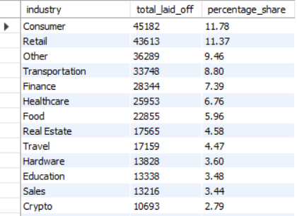

# Layoffs Data Cleaning & Exploratory Data Analysis (MySQL)

---

## Overview

This project focuses on **cleaning and analyzing global layoffs data** using SQL.

The dataset contained inconsistencies such as duplicates, missing values, and formatting issues. These were resolved using SQL techniques, followed by exploratory analysis to uncover trends in layoffs across companies, industries, and time.

---

## Objectives

* Clean raw layoffs dataset
* Remove duplicates and inconsistencies
* Standardize data formats
* Perform exploratory data analysis (EDA)
* Identify trends in layoffs over time

---

## Data Cleaning Process

* Removed duplicate records using `ROW_NUMBER()`
* Handled missing and null values
* Standardized date formats using `YEAR()`
* Cleaned inconsistent categorical values (company, industry, country)
* Created staging tables for safe transformations

---

## Key SQL Techniques Used

* **CTEs (Common Table Expressions)**
* **Window Functions** (`ROW_NUMBER()`, `DENSE_RANK()`)
* **Aggregations** (`SUM`, `GROUP BY`, `HAVING`)
* **Filtering & Conditional Logic**

---

## Key Analysis Queries

### Top 5 Companies with Highest Layoffs Per Year

```sql id="q1"
WITH company_year AS (
    SELECT company, YEAR(date) AS years, 
           SUM(total_laid_off) AS total_laid_off
    FROM layoffs_staging2
    WHERE YEAR(date) IS NOT NULL
    GROUP BY company, YEAR(date)
),
company_year_rank AS (
    SELECT *, 
           DENSE_RANK() OVER(PARTITION BY years ORDER BY total_laid_off DESC) AS ranking
    FROM company_year
)
SELECT *
FROM company_year_rank
WHERE ranking <= 5;
```

This query identifies **top companies contributing to layoffs each year**, helping track major workforce reductions.

---

### Removing Duplicates Using Window Function

```sql id="q2"
# Step-1, Look for unique col, we don't have that in this case, so we assign row_num partitioned by every column in the table
WITH duplicate_cte AS (
SELECT *, ROW_NUMBER() OVER(
	partition by company, location, industry, total_laid_off, percentage_laid_off, `date`, stage, country, funds_raised_millions) as row_num
FROM layoffs_staging)

# Step-2, Look for the duplicate values (row_num>1)
SELECT * FROM duplicate_cte
WHERE row_num>1;
```

Used to **identify and remove duplicate records**, ensuring data accuracy before analysis.

---

## Preview
industry_wise_trend
<p align="center">
  
</p>

top_5_companies_yearly
<p align="center">
  
</p>

yoy_change
<p align="center">
  
</p>

---

## Key Insights

### Year-wise Layoff Trends
* Layoffs increased significantly from 2020 to 2023, indicating prolonged economic instability and post-pandemic corrections
* 2023 recorded the highest layoffs, led by companies like Google (12K), Microsoft (10K), and Amazon (8K+)
* Layoffs shifted from travel-heavy industries (2020) to tech-driven layoffs in later years

### Company-Level Insights
* Layoffs are highly concentrated among a few large companies each year
* Top 5 companies dominate layoffs annually, indicating centralized workforce reduction rather than distributed cuts
* Big Tech (Meta, Amazon, Google, Microsoft) played a major role in 2022–2023 layoffs

### Industry-Level Insights
* Consumer (11.78%) and Retail (11.37%) sectors contributed the highest share of layoffs
* “Other” category (~9.5%) suggests diversified layoffs across multiple smaller industries
* Transportation and Finance sectors also showed significant workforce reductions (~8–9%)
* Emerging sectors like Crypto (2.79%) still show notable layoffs despite smaller share

---

## How to Use

1. Import dataset into MySQL
2. Run data cleaning queries
3. Execute EDA queries
4. Analyze results

---

## Highlights

* Performed **end-to-end data cleaning using SQL**
* Used **advanced window functions** (`ROW_NUMBER`, `DENSE_RANK`, `LAG`)
* Built **modular queries using CTEs**
* Extracted **year-wise company-level insights**
* Ensured **data integrity before analysis**

---

## Business Impact

* Identifies high-risk industries during economic downturns
* Helps organizations plan sustainable hiring strategies
* Supports predictive workforce planning using historical patterns
* Supports understanding of **economic and industry shifts**

---

## What I Learned
* Importance of data cleaning before analysis
* Practical use of window functions for deduplication and ranking
* Structuring complex queries using CTEs
* Translating raw data into meaningful insights

---
